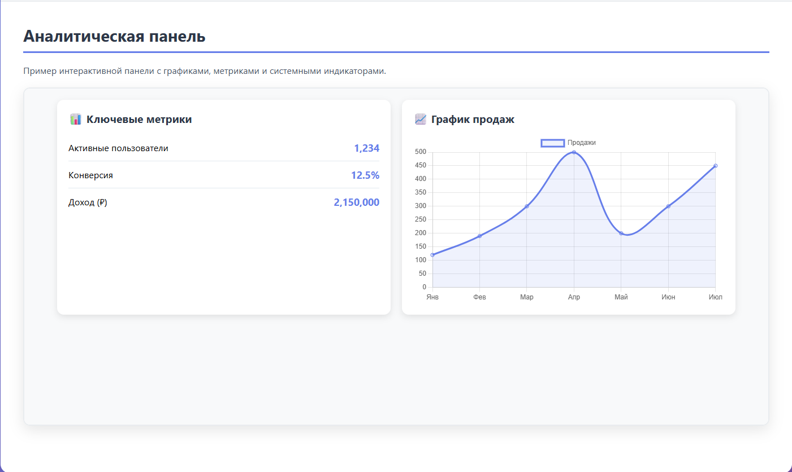
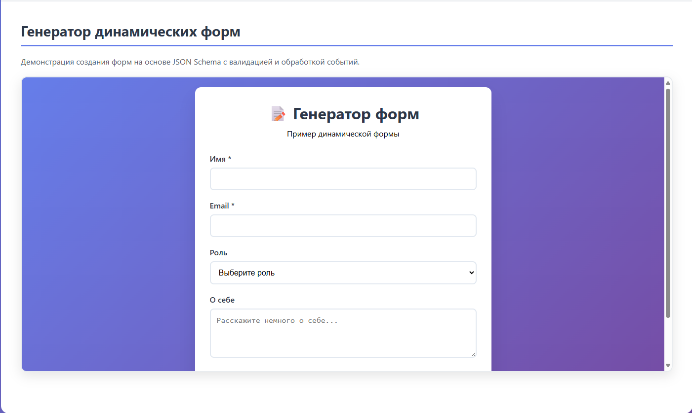

<div align="center">

# 🤖 MCP UI Generator

**АВТОМАТИЧЕСКИЙ ГЕНЕРАТОР ИНТЕРФЕЙСА ДЛЯ MCP СЕРВЕРОВ**

---


### Искусственный интеллект создает веб-интерфейсы автоматически

 [](https://opensource.org/licenses/Apache-2.0) [](https://www.typescriptlang.org/) [](https://reactjs.org/) [](https://nodejs.org/)

<p align="center">
  <a href="https://www.npmjs.com/package/@mcp-ui/server"></a>
  <a href="https://www.npmjs.com/package/@mcp-ui/client"></a>
  <a href="https://github.com/ivan-meer/mcp-ui/releases"></a>
</p>

<p align="center">
  <a href="https://github.com/ivan-meer/mcp-ui/actions"></a>
  <a href="https://github.com/ivan-meer/mcp-ui/issues"></a>
  <a href="https://github.com/ivan-meer/mcp-ui/stargazers"></a>
</p>

📖 **[English Documentation](./docs/DOCUMENTATION.md)** | 🎯 **[Demo & Live Examples](./demo.html)**

> 🚀 **РЕВОЛЮЦИОННЫЙ ПОДХОД К СОЗДАНИЮ UI**
> 
> <div style="display: flex; justify-content: space-between;">
>   
>   
>   
> </div>

</div>

---

## 🧠 Что такое MCP UI Generator?

**MCP UI Generator** — это революционная система автоматической генерации веб-интерфейсов для Model Context Protocol серверов. Используя возможности искусственного интеллекта, генератор автоматически создает адаптивные, интерактивные пользовательские интерфейсы на основе функций и возможностей вашего MCP сервера.

### 🚀 Автоматическое создание UI без кода!

### 🤖 Принцип работы AI-генератора

1. **Анализ MCP сервера** — ИИ изучает ваши функции, инструменты и ресурсы
2. **Генерация дизайна** — Автоматическое создание адаптивного интерфейса
3. **Создание компонентов** — Интеллектуальная сборка React-компонентов
4. **Оптимизация UX** — Применение лучших практик пользовательского опыта

### 🔥 Революционные возможности

**🧠 AI-Генерация (`@mcp-ui/generator`)**
- 🤖 Автоматический анализ MCP серверов
- 🎨 Интеллектуальная генерация UI компонентов
- 📱 Адаптивный дизайн для всех устройств
- ⚡ Мгновенное создание интерфейсов

**🛠️ Smart Components (`@mcp-ui/client`)**
- 🔄 Автоматическое связывание с MCP функциями
- 🎭 Динамические формы и интерфейсы
- 🔐 Безопасность и валидация из коробки
- 🚀 Современные анимации и переходы

### ⚡ Мгновенный запуск

```bash
# 1. Установка AI-генератора
pnpm install

# 2. Запуск автогенерации для вашего MCP сервера
npx @mcp-ui/generator analyze --server=your-mcp-server.json

# 3. Автоматическое создание UI
npx @mcp-ui/generator generate --output=./generated-ui

# 4. Просмотр результата
./start-demo.sh
```

### 🎯 AI-генерированные компоненты

Генератор автоматически создает **профессиональные UI компоненты** на основе анализа вашего MCP сервера:

| 🤖 **Автоформы** | 📊 **Дашборды** | 🎨 **Галереи** |
|:---:|:---:|:---:|
| Умные формы из схем | Аналитика в реальном времени | Медиа-контент |

| 📋 **Таблицы** | 💬 **Чаты** | 🔧 **Настройки** |
|:---:|:---:|:---:|
| Данные и CRUD | Интерактивность | Конфигурация |

### 📈 Примеры автогенерации

```javascript
// Ваш MCP сервер определяет функцию
const mcpFunction = {
  name: "create_user",
  parameters: {
    name: "string",
    email: "string", 
    role: "enum"
  }
};

// AI автоматически создает форму
const generatedUI = await generator.createForm(mcpFunction);
// Результат: Адаптивная форма с валидацией, стилями и UX
```

### 🛠️ Архитектура проекта

```
mcp-ui/
├── packages/
│   ├── client/          # React компоненты
│   ├── server/          # Серверные утилиты
│   └── shared/          # Общие типы и утилиты
├── examples/
│   └── server/          # Пример MCP сервера
├── docs/                # Документация
├── demo.html           # Интерактивное демо
└── start-demo.sh       # Скрипт автозапуска
```

### 🎯 Использование

#### Серверная часть

```typescript
import { createHtmlResource } from '@mcp-ui/server';

// Создание интерактивного компонента
const dashboard = createHtmlResource({
  uri: 'ui://dashboard/analytics',
  content: `
    <div class="dashboard">
      <h2>Аналитика продаж</h2>
      <canvas id="chart"></canvas>
    </div>
  `,
  css: './styles/dashboard.css',
  js: './scripts/chart-setup.js'
});
```

#### Клиентская часть

```tsx
import { HtmlResource } from '@mcp-ui/client';

function App() {
  return (
    <HtmlResource
      resource={{
        uri: 'ui://dashboard/analytics',
        mimeType: 'text/html',
        text: htmlContent
      }}
      onEvent={(event) => console.log('UI Event:', event)}
    />
  );
}
```

## 🚀 Попробуйте прямо сейчас!

### ⚡ Быстрый старт для разработчиков

```bash
# Клонирование репозитория
git clone https://github.com/ivan-meer/mcp-ui.git
cd mcp-ui

# Установка и запуск
pnpm install
./start-demo.sh
```

**Готово!** Через 30 секунд у вас будет работающий AI-генератор интерфейсов.

### 🎯 Для продакшена

```bash
# Установка пакета
npm install @mcp-ui/generator

# Генерация UI для вашего MCP сервера
npx mcp-ui generate --server=./your-mcp-config.json
```

### 🌐 Поддерживаемые схемы

- **`ui://`** — Встроенные компоненты с полной изоляцией
- **`ui-app://`** — Внешние приложения с безопасным доступом
- **`ui-gen://`** — AI-генерированные интерфейсы

### 📚 Документация и ресурсы

- 📖 **[Полная документация](./docs/DOCUMENTATION.md)** 
- 🎯 **[Руководство по AI-генерации](./docs/AI_GUIDE.md)**
- 🚀 **[Живые примеры](./demo.html)**
- 🔧 **[API справочник](./docs/API.md)**

### 🤝 Сообщество

Присоединяйтесь к нашему сообществу разработчиков! [Руководство по участию](./CONTRIBUTING.md).

### 📄 Лицензия

Apache 2.0 License - [полный текст](./LICENSE)

---

<div align="center">
  <p><strong>FORKED FROM</strong> <a href="https://github.com/idosal/mcp-ui">@IDOSAL/MCP-UI</a></p>
  <p><strong>DEVELOPED BY</strong></p>
  
  <p><a href="https://how2ai.info"><strong>HOW2AI AGENCY</strong></a></p>
