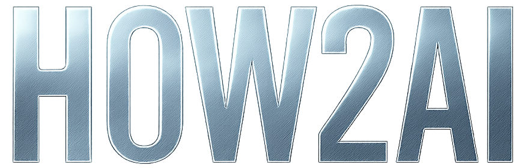

<div align="center">

# 🎨 MCP UI SDK


---

<div align="center">


### Интерактивный TypeScript SDK для Model Context Protocol веб-компонентов

 [](https://opensource.org/licenses/Apache-2.0) [](https://www.typescriptlang.org/) [](https://reactjs.org/) [](https://nodejs.org/)

<p align="center">
  <a href="https://www.npmjs.com/package/@mcp-ui/server"></a>
  <a href="https://www.npmjs.com/package/@mcp-ui/client"></a>
  <a href="https://github.com/ivan-meer/mcp-ui/releases"></a>
</p>

<p align="center">
  <a href="https://github.com/ivan-meer/mcp-ui/actions"></a>
  <a href="https://github.com/ivan-meer/mcp-ui/issues"></a>
  <a href="https://github.com/ivan-meer/mcp-ui/stargazers"></a>
</p>

> 🚧 **ЭКСПЕРИМЕНТАЛЬНЫЙ ПРОЕКТ В РАЗРАБОТКЕ**
> 
> <p align="center">
>  <strong>ФОРК ОТ</strong> <a href="https://github.com/idosal/mcp-ui">@IDOSAL/MCP-UI</a><br/>
>  <strong>РАЗРАБОТАНО</strong><br/>
>  <br/>
>  <a href="https://how2ai.info"><strong>AGENCY</strong></a>
> </p>

📖 **[English Documentation](./docs/DOCUMENTATION.md)** | 🎯 **[Demo & Live Examples](./demo.html)**

</div>

---

## 🎯 Что такое MCP UI SDK?

**MCP UI SDK** — это TypeScript-библиотека для создания интерактивных веб-компонентов в рамках Model Context Protocol (MCP). Проект предоставляет готовые инструменты для разработки современных пользовательских интерфейсов, которые могут быть легко интегрированы в MCP-серверы и клиенты.

### ✨ Основные возможности

<table>
<tr>
<td width="50%">

**🔧 Серверная часть (`@mcp-ui/server`)**
- Утилиты для создания `HtmlResourceBlock` объектов
- Безопасная генерация HTML-ресурсов
- Поддержка различных UI схем (`ui://`, `ui-app://`)
- Встроенная валидация и типизация

</td>
<td width="50%">

**🎨 Клиентская часть (`@mcp-ui/client`)**
- React-компоненты для рендеринга HTML-ресурсов
- Безопасная обработка iframe с DOMPurify
- Система событий для взаимодействия с UI
- Responsive дизайн и современные анимации

</td>
</tr>
</table>

### 🚀 Быстрый старт

```bash
# Установка зависимостей
pnpm install

# Запуск демо-версии
./start-demo.sh

# Разработка
pnpm dev

# Тестирование
pnpm test
```

### 🎭 Демонстрационные компоненты

Проект включает в себя **6 готовых UI-компонентов** для демонстрации возможностей:

<div align="center">

| 🖼️ **Галерея** | 📊 **Аналитика** | 📝 **Формы** |
|:---:|:---:|:---:|
| Интерактивная галерея изображений | Дашборд с Chart.js | Динамические формы |

| 📅 **Календарь** | 💬 **Чат** | 📁 **Файл-менеджер** |
|:---:|:---:|:---:|
| События и планирование | Интерфейс сообщений | Управление файлами |

</div>

### 🛠️ Архитектура проекта

```
mcp-ui/
├── packages/
│   ├── client/          # React компоненты
│   ├── server/          # Серверные утилиты
│   └── shared/          # Общие типы и утилиты
├── examples/
│   └── server/          # Пример MCP сервера
├── docs/                # Документация
├── demo.html           # Интерактивное демо
└── start-demo.sh       # Скрипт автозапуска
```

### 🎯 Использование

#### Серверная часть

```typescript
import { createHtmlResource } from '@mcp-ui/server';

// Создание интерактивного компонента
const dashboard = createHtmlResource({
  uri: 'ui://dashboard/analytics',
  content: `
    <div class="dashboard">
      <h2>Аналитика продаж</h2>
      <canvas id="chart"></canvas>
    </div>
  `,
  css: './styles/dashboard.css',
  js: './scripts/chart-setup.js'
});
```

#### Клиентская часть

```tsx
import { HtmlResource } from '@mcp-ui/client';

function App() {
  return (
    <HtmlResource
      resource={{
        uri: 'ui://dashboard/analytics',
        mimeType: 'text/html',
        text: htmlContent
      }}
      onEvent={(event) => console.log('UI Event:', event)}
    />
  );
}
```

### 🌐 Схемы URI

- **`ui://`** — Самостоятельный HTML контент (iframe с `srcDoc`)
- **`ui-app://`** — Внешние приложения (iframe с `src`)

### 🧪 Тестирование

```bash
# Запуск тестов
pnpm test

# Тесты в режиме наблюдения
pnpm test:watch

# Покрытие кода
pnpm coverage
```

### 📚 Документация

- 📖 **[Полная документация](./docs/DOCUMENTATION.md)** (English)
- 🎯 **[Руководство по компонентам](./docs/COMPONENTS.md)**
- 🚀 **[Демо и примеры](./docs/DEMO_GUIDE.md)**
- 🔧 **[API справочник](./docs/API.md)**

### 🤝 Вклад в развитие

Мы приветствуем вклад в развитие проекта! Пожалуйста, ознакомьтесь с [руководством по участию](./CONTRIBUTING.md).

### 📄 Лицензия

Этот проект распространяется под лицензией [Apache 2.0](./LICENSE).

---

<div align="center">
  <p><strong>FORKED FROM</strong> <a href="https://github.com/idosal/mcp-ui">@IDOSAL/MCP-UI</a></p>
  <p><strong>DEVELOPED BY</strong></p>
  
  <p><a href="https://how2ai.info"><strong>HOW2AI AGENCY</strong></a></p>
